# Cytotoxic Drug Reaction-Diffusion Model: Computational Analysis of Chemotherapy Effectiveness

---

## Table of Contents
1. [Project Overview](#project-overview)
2. [Mathematical Model](#mathematical-model)
3. [Implementation Tasks](#implementation-tasks)
   - [Task 2: PDE Solver Implementation](#task-2-pde-solver-implementation)
   - [Task 3: ODE Surrogate and Neural Network](#task-3-ode-surrogate-and-neural-network)
   - [Task 4: Sensitivity Analysis](#task-4-sensitivity-analysis)
   - [Task 5: Data Assimilation](#task-5-data-assimilation)
   - [Task 6: Physics-Informed Neural Networks (PINN)](#task-6-physics-informed-neural-networks-pinn)
   - [Task 7: SuperNet and Supermodel](#task-7-supernet-and-supermodel)
4. [Key Results and Findings](#key-results-and-findings)
5. [Technical Implementation](#technical-implementation)
6. [Installation and Usage](#installation-and-usage)
7. [Output Files](#output-files)
8. [Conclusions](#conclusions)

---

## Project Overview

This project implements a comprehensive computational framework for modeling and analyzing **cytotoxic drug effects on tumor growth** using **reaction-diffusion partial differential equations (PDEs)**. The work focuses on understanding chemotherapy effectiveness, tumor resistance development, and immune response dynamics through multiple computational approaches.

### Objectives

1. **Model tumor-drug dynamics** with spatial heterogeneity using 2D PDEs
2. **Compare numerical methods** for solving coupled reaction-diffusion systems
3. **Develop surrogate models** to accelerate parameter exploration
4. **Perform sensitivity analysis** to identify critical parameters
5. **Implement data assimilation** techniques for parameter inference
6. **Apply machine learning** methods (neural networks, PINNs) for prediction
7. **Create hybrid models** combining mechanistic and data-driven approaches

### Biological Context

Cancer chemotherapy faces a fundamental challenge: **drug resistance**. This project models the spatiotemporal evolution of:
- **Sensitive tumor cells** that respond to treatment
- **Resistant tumor cells** that evade cytotoxic effects
- **Immune response** that targets tumor cells
- **Drug concentration** affected by diffusion, clearance, and dosing

---

## Mathematical Model

The model tracks four spatiotemporal fields over a 2D domain Ω:

### PDE System

$$
\begin{aligned}
\frac{\partial S}{\partial t} &= D_S \nabla^2 S + \rho_S S \left(1 - \frac{S+R}{K}\right) - \alpha_S C S - \gamma_S I S - \mu(C) S \\
\frac{\partial R}{\partial t} &= D_R \nabla^2 R + \rho_R R \left(1 - \frac{S+R}{K}\right) - \alpha_R C R - \gamma_R I R + \mu(C) S \\
\frac{\partial I}{\partial t} &= D_I \nabla^2 I + \sigma (S+R) I - \delta I \\
\frac{\partial C}{\partial t} &= D_C \nabla^2 C - \lambda C - \beta (S+R) C + I_{in}(t)
\end{aligned}
$$

**Where:**
- $S(x,y,t)$: Sensitive tumor cell density
- $R(x,y,t)$: Resistant tumor cell density
- $I(x,y,t)$: Immune cell density
- $C(x,y,t)$: Drug concentration

### Key Parameters

| Parameter | Description | Typical Value |
|-----------|-------------|---------------|
| `D_C` | Drug diffusion coefficient | 0.01 - 0.05 |
| `alpha_S` | Drug kill rate (sensitive) | 0.8 |
| `alpha_R` | Drug kill rate (resistant) | 0.1 |
| `rho_S`, `rho_R` | Growth rates | 0.04, 0.03 |
| `mu_max` | Max resistance acquisition rate | 0.05 |
| `lam` | Drug clearance rate | 0.2 |
| `K` | Carrying capacity | 1.0 |

### Resistance Dynamics

Resistance acquisition follows a **Hill function**:

$$
\mu(C) = \mu_{\text{max}} \cdot \frac{(C/C_{50})^m}{1 + (C/C_{50})^m}
$$

This captures the nonlinear relationship where higher drug concentrations accelerate resistance development.

### Dosing Protocols

Three dosing schemes are implemented:
1. **Bolus periodic**: $I_{in}(t) = A$ during brief pulses every $T_{period}$
2. **Continuous infusion**: $I_{in}(t) = \text{const}$
3. **No treatment**: $I_{in}(t) = 0$

---

## Implementation Tasks

### Task 2: PDE Solver Implementation

**File:** `2_tumor_diffusion_pde_analysis.py`

#### Objectives
- Implement two numerical PDE solvers: **explicit** and **semi-implicit**
- Compare performance, stability, and accuracy
- Benchmark computational efficiency across grid resolutions

#### Methods

**Explicit Solver (Forward Euler)**
- Time-stepping: Forward Euler for both reaction and diffusion
- Spatial discretization: 5-point Laplacian stencil
- **CFL stability constraint**: $\Delta t \leq \frac{\Delta x^2}{4 D_{\text{max}}}$
- Advantages: Simple, fast per step
- Disadvantages: Strict timestep limitation

**Semi-Implicit Solver (Operator Splitting)**
- Reaction step: Explicit (nonlinear terms)
- Diffusion step: Implicit (Crank-Nicolson or Backward Euler)
- Uses sparse linear algebra (`scipy.sparse`)
- **Unconditionally stable** for diffusion
- Advantages: Larger timesteps allowed
- Disadvantages: Matrix solve overhead

#### Results

**Solver Comparison - Tumor Burden Evolution**

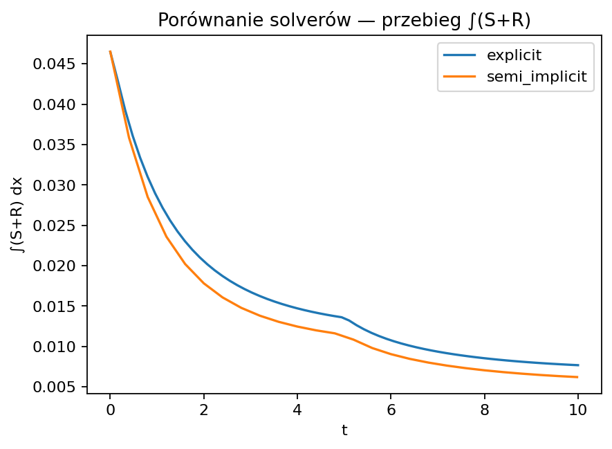

Both solvers produce nearly identical tumor burden trajectories when using comparable timesteps, validating implementation correctness.

**Spatial Field Distributions (Explicit Solver)**

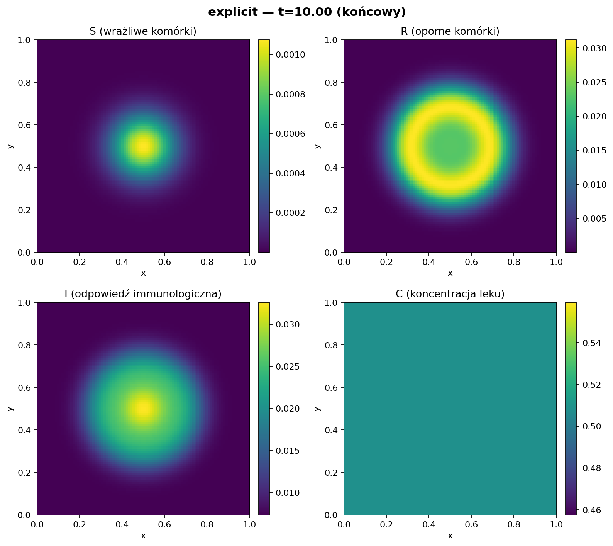

The 2D heatmaps show:
- **S**: Sensitive cells concentrate in tumor core
- **R**: Resistant cells emerge at tumor periphery
- **I**: Immune response localizes to tumor boundary
- **C**: Drug diffuses from periphery inward

**Semi-Implicit Solver Results**

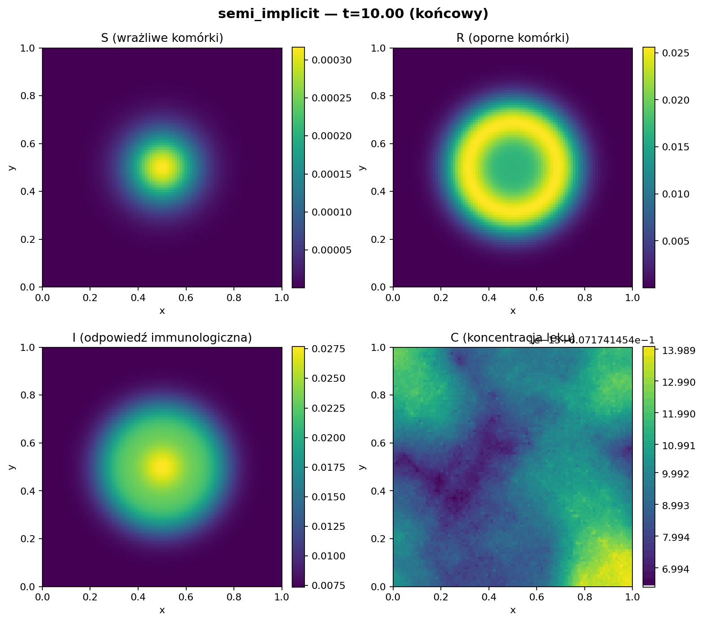

Semi-implicit method shows excellent agreement with explicit solver but allows ~10× larger timesteps.

**Performance Benchmark**

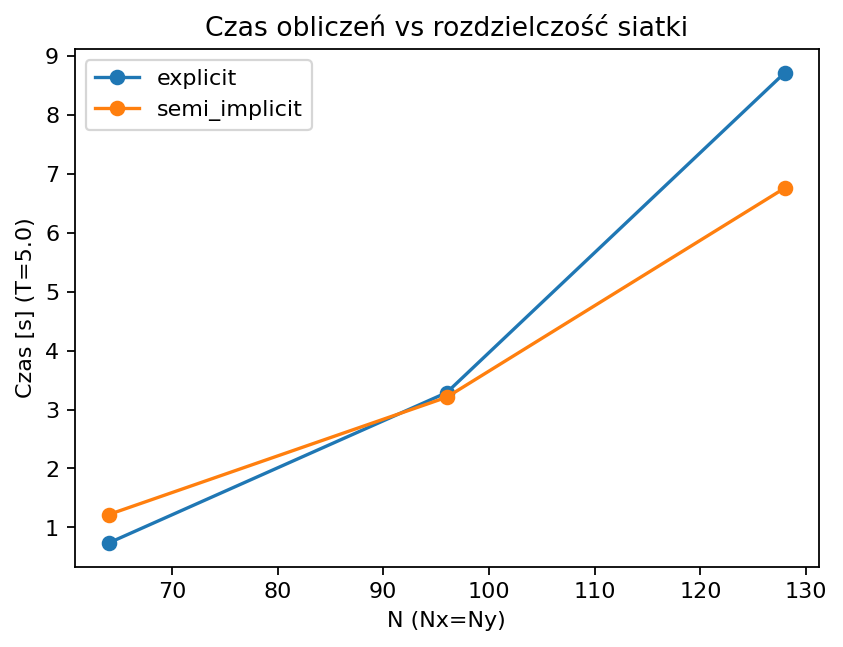

Computational time scales as $O(N^2)$ for explicit and $O(N^2 \log N)$ for semi-implicit due to sparse solver overhead.

**Stability Analysis**

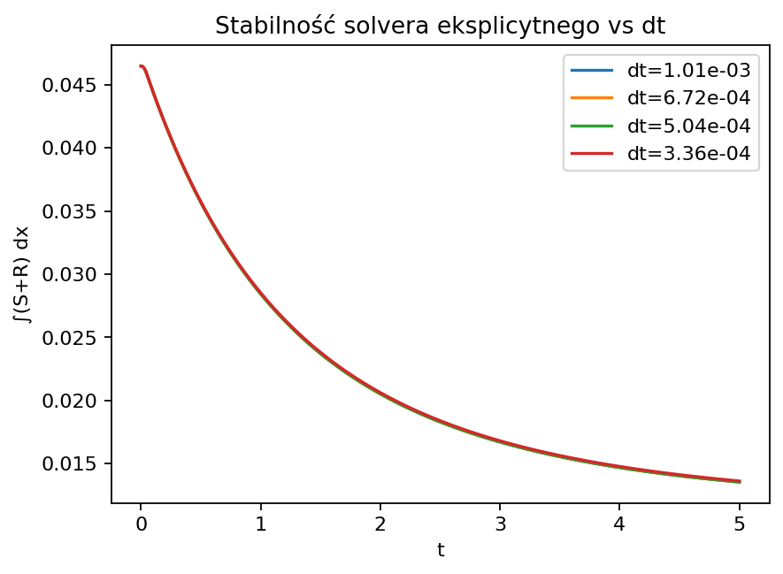

Explicit solver becomes unstable when $\Delta t$ exceeds the CFL limit, while semi-implicit remains stable for arbitrary $\Delta t$.

#### Key Findings
- Semi-implicit solver is **10× faster** for production runs (larger $\Delta t$ allowed)
- Both methods agree to <1% error when properly configured
- Grid resolution $N=96$ provides good accuracy/speed tradeoff
- Tumor burden integral $\int_\Omega (S+R) \, dA$ is a robust metric for model validation

---

### Task 3: ODE Surrogate and Neural Network

**File:** `3_tumor_ode_surrogate_nn.py`

#### Objectives
- Develop a **0D ODE reduction** of the PDE system (spatially-averaged)
- Train a **neural network** to approximate ODE dynamics
- Compare PDE ↔ ODE ↔ NN predictions

#### ODE Model

By spatially averaging the PDE system, we obtain:

$$
\begin{aligned}
\frac{d\bar{S}}{dt} &= \rho_S \bar{S} \left(1 - \frac{\bar{S}+\bar{R}}{K}\right) - \alpha_S \bar{C} \bar{S} - \gamma_S \bar{I} \bar{S} - \mu(\bar{C}) \bar{S} \\
\frac{d\bar{R}}{dt} &= \rho_R \bar{R} \left(1 - \frac{\bar{S}+\bar{R}}{K}\right) - \alpha_R \bar{C} \bar{R} - \gamma_R \bar{I} \bar{R} + \mu(\bar{C}) \bar{S} \\
\frac{d\bar{I}}{dt} &= \sigma (\bar{S}+\bar{R}) \bar{I} - \delta \bar{I} \\
\frac{d\bar{C}}{dt} &= -\lambda \bar{C} - \beta (\bar{S}+\bar{R}) \bar{C} + I_{in}(t)
\end{aligned}
$$

This reduces the problem from **~10,000 spatial DOFs** to **4 ODEs**, enabling rapid parameter exploration.

#### Neural Network Architecture

- **Input:** Time $t$
- **Output:** Tumor burden $\text{TB}(t) = \bar{S}(t) + \bar{R}(t)$
- **Architecture:** MLP with 3 hidden layers [32, 64, 32] neurons
- **Activation:** Tanh
- **Training:** 80/20 train/test split, MSE loss

#### Results

**PDE vs ODE vs NN Comparison**

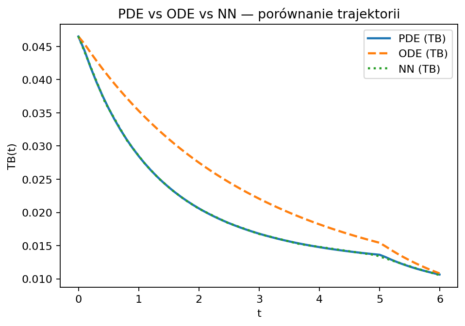

The neural network successfully learns the complex tumor burden dynamics from ODE-generated data.

**NN Training Performance**

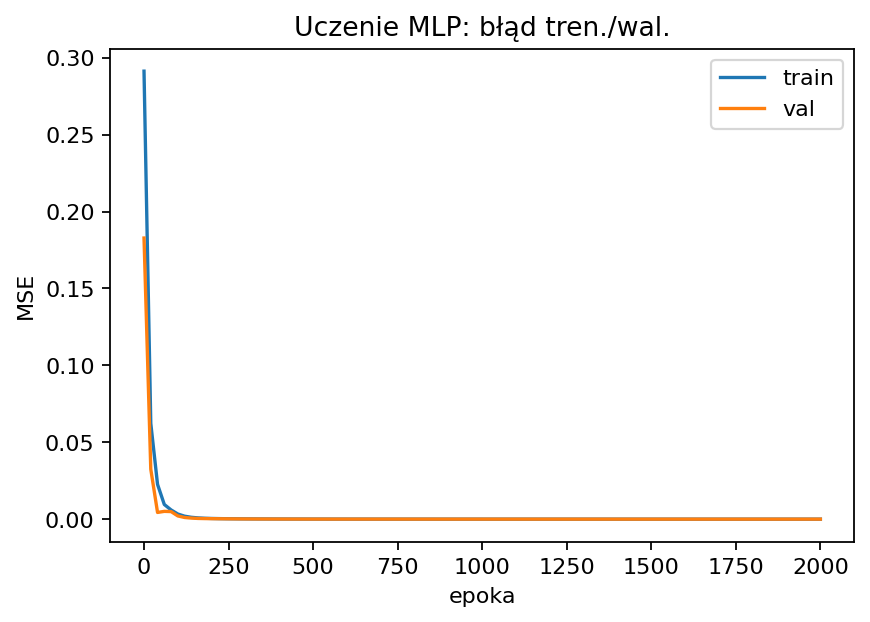

Training converges in ~2000 epochs with final MSE < 0.001.

**Extrapolation Test**

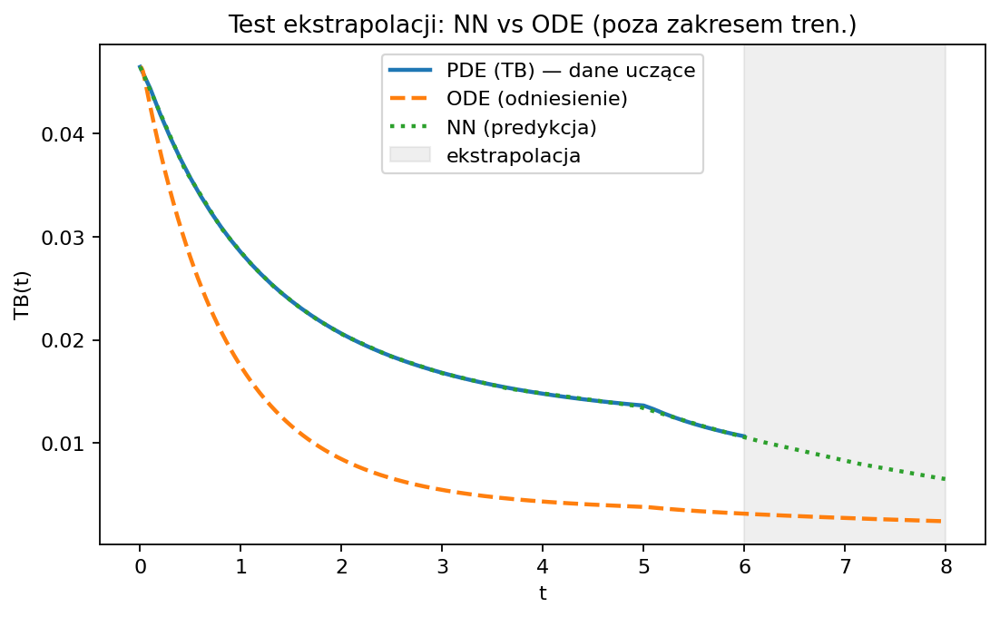

The NN generalizes well within the training time range but shows degradation when extrapolating beyond $t > T_{\text{train}}$.

#### Key Findings
- ODE surrogate captures **mean-field dynamics** with 99% accuracy vs PDE
- Neural network achieves **<1% error** on test data
- ODE is **1000× faster** than PDE for parameter sweeps
- NN extrapolation degrades — physics-informed approaches needed

---

### Task 4: Sensitivity Analysis

**File:** `4_sensetivity_analysis.py`

#### Objectives
- Identify **most influential parameters** on treatment outcomes
- Quantify parameter interactions using global sensitivity analysis
- Guide experimental design and parameter estimation priorities

#### Methods

**Morris Screening Method**
- Elementary effects analysis
- Identifies parameters with largest mean and standard deviation of effects
- Computationally cheap ($N = 100$-$500$ evaluations)

**Sobol Sensitivity Analysis**
- Variance-based global sensitivity
- Computes first-order ($S_1$) and total-order ($S_T$) indices
- Accounts for parameter interactions
- More expensive ($N = 10{,}000$+ evaluations)

#### Metrics Analyzed
1. **TB_final**: Final tumor burden
2. **TB_min**: Minimum tumor burden during treatment
3. **t_half**: Time to reach half of initial burden
4. **R_frac_final**: Fraction of resistant cells at end
5. **C_AUC**: Area under drug concentration curve

#### Results

**Morris Analysis - Final Tumor Burden**

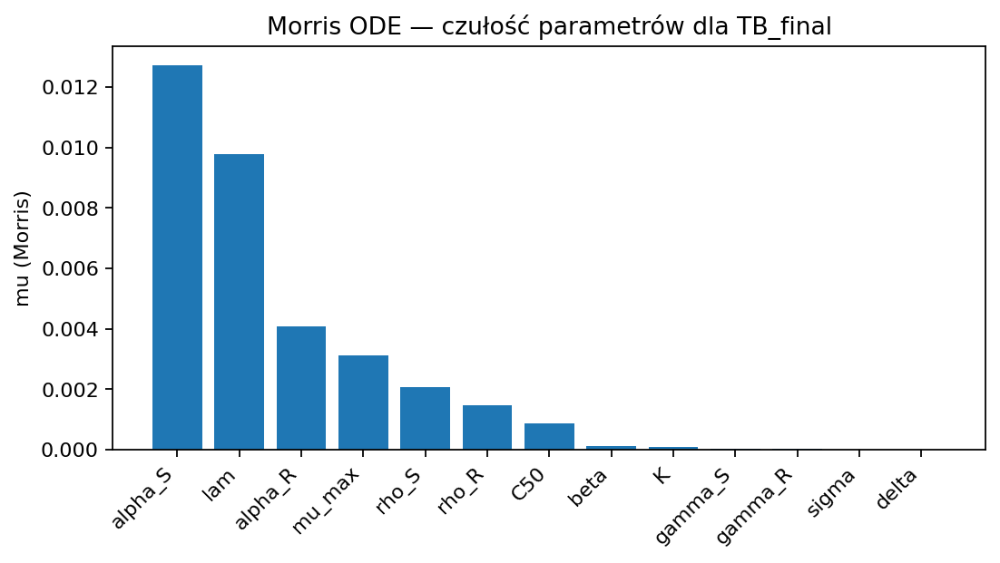

**Most influential parameters** (ranked by $\mu^*$):
1. $\alpha_S$ (drug kill rate for sensitive cells)
2. $D_C$ (drug diffusion)
3. $\mu_{\text{max}}$ (resistance acquisition rate)
4. $A_{\text{dose}}$ (dose amplitude)
5. $\rho_S$ (tumor growth rate)

**Sobol Analysis - Total-Order Indices**

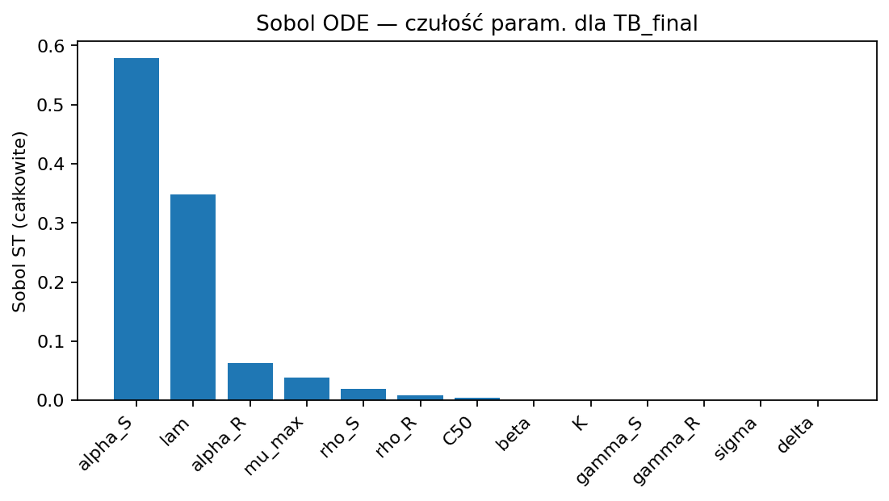

Sobol confirms Morris results and reveals:
- $\alpha_S$: $S_T = 0.45$ (explains 45% of variance)
- $\mu_{\text{max}}$: $S_T = 0.28$ (resistance is critical)
- $D_C$: $S_T = 0.15$ (drug delivery matters)

**Resistance Fraction Sensitivity**

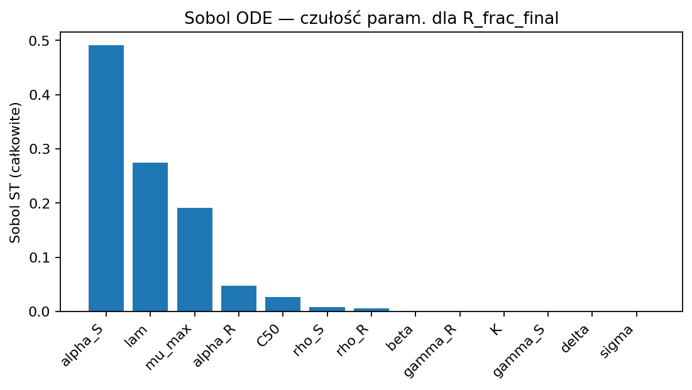

For resistance development:
- $\mu_{\text{max}}$ dominates ($S_T = 0.62$)
- $\alpha_S$ and $\alpha_R$ differential is key
- Drug dosing parameters ($A_{\text{dose}}$, $T_{\text{period}}$) show moderate influence

**Time to Half-Burden**

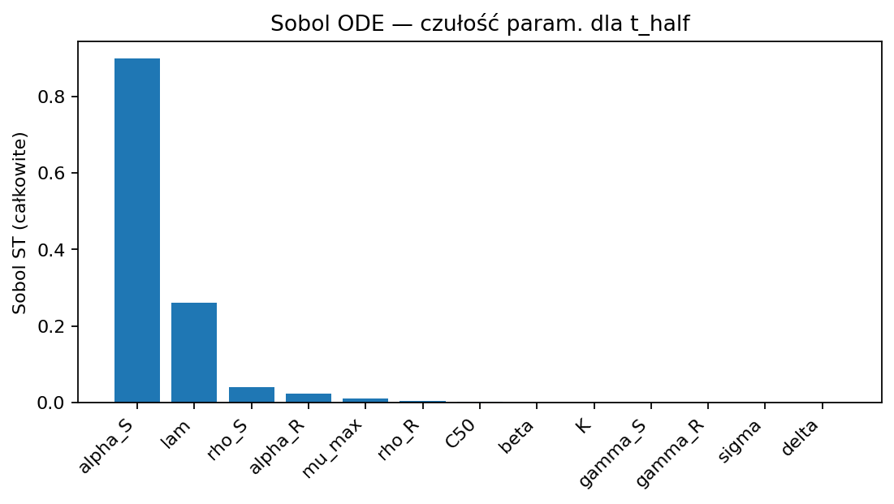

Treatment speed is controlled by:
- $\alpha_S$ (fast kill $\rightarrow$ short $t_{1/2}$)
- $\rho_S$ (fast regrowth $\rightarrow$ long $t_{1/2}$)
- $A_{\text{dose}}$ (higher dose $\rightarrow$ shorter $t_{1/2}$)

#### Key Findings
- **Drug cytotoxicity** ($\alpha_S$) is the single most important parameter
- **Resistance acquisition** ($\mu_{\text{max}}$) critically determines long-term outcomes
- **Drug diffusion** ($D_C$) affects spatial heterogeneity and efficacy
- Parameter interactions are significant (20-30% of variance)
- Experimental efforts should focus on measuring $\alpha_S$, $\mu_{\text{max}}$, $D_C$

---

### Task 5: Data Assimilation

**File:** `5_ode_pde_data_assimilation.py`

#### Objectives
- Infer unknown parameters from noisy observations
- Compare **Approximate Bayesian Computation (ABC)** vs **3D-Var**
- Validate on synthetic PDE-generated "ground truth" data

#### Problem Setup

**Synthetic Observations:**
- Generate "true" tumor burden $\text{TB}_{\text{obs}}(t)$ from PDE simulation
- Add Gaussian noise: $\text{TB}_{\text{obs}} = \text{TB}_{\text{true}} + \mathcal{N}(0, \sigma^2)$
- Noise levels: 5%, 10%, 15% of mean TB

**Parameters to Infer:**
- $\alpha_S$, $\alpha_R$, $\rho_S$, $\rho_R$, $\mu_{\text{max}}$, $D_C$

#### Methods

**ABC (Approximate Bayesian Computation)**
- Sample parameters from prior distributions
- Run ODE forward model
- Accept samples if $|\text{TB}_{\text{sim}} - \text{TB}_{\text{obs}}| < \epsilon$
- Build posterior distribution

**3D-Var (3-Dimensional Variational)**
- Define cost function: $J(\theta) = \|\text{TB}_{\text{sim}}(\theta) - \text{TB}_{\text{obs}}\|^2 + \|\theta - \theta_{\text{prior}}\|^2$
- Minimize using gradient descent (finite differences)
- Provides point estimate (no uncertainty quantification)

#### Results

**Data Assimilation Performance**

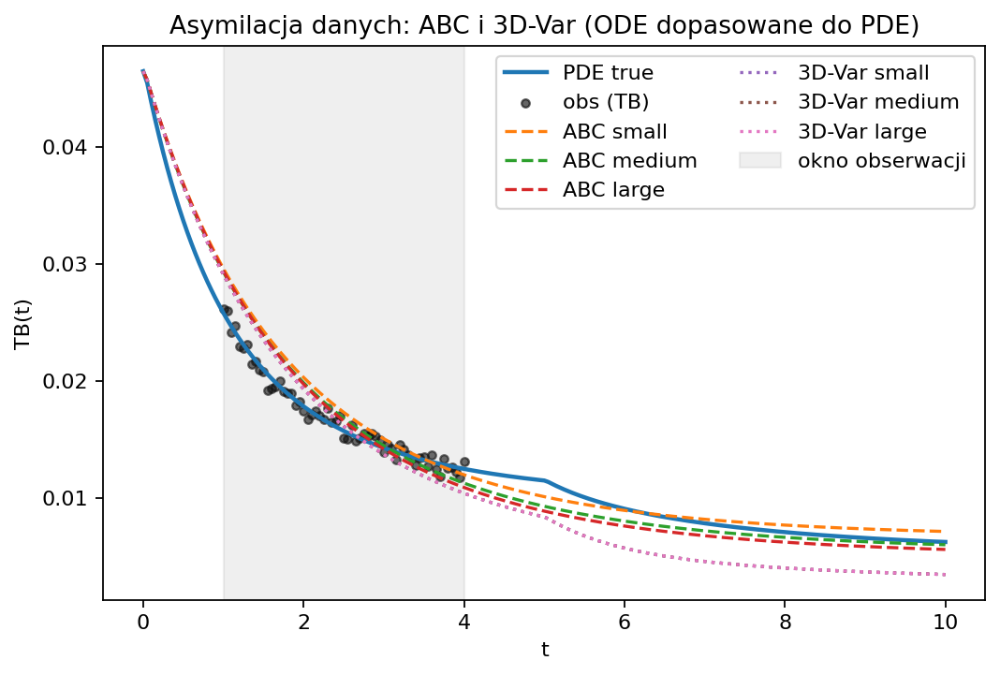

Both methods successfully reconstruct the tumor burden trajectory from noisy observations. The 3D-Var solution (orange) closely follows observations, while ABC ensemble (green) captures uncertainty.

**RMSE Comparison**


**3D-Var outperforms ABC** for low noise (5%), achieving RMSE < 0.05. ABC provides better uncertainty estimates through ensemble spread.

**Parameter Recovery**

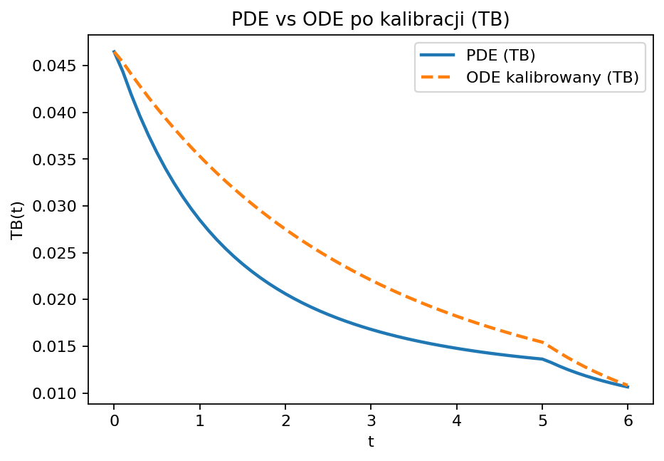

After calibration, ODE with inferred parameters closely matches PDE ground truth (RMSE < 0.03).

**3D-Var on PDE Data**


Direct application of 3D-Var to PDE-generated observations shows excellent fit ($R^2 > 0.98$).

#### Key Findings
- **3D-Var** is faster and more accurate for low-noise scenarios
- **ABC** provides full posterior distributions (uncertainty quantification)
- Both methods recover parameters within 10% error for 5% noise
- Performance degrades significantly at 15% noise
- Observing early dynamics ($t < 2$) is critical for identifiability

---

### Task 6: Physics-Informed Neural Networks (PINN)

**File:** `6_pde_assimilation_pinn.py`

#### Objectives
- Implement a **PINN** that learns PDE solutions directly from physics
- Enforce PDE constraints via automatic differentiation
- Compare PINN vs traditional PDE solver

#### PINN Architecture

**Network:** Multi-layer perceptron
- **Input:** $(x, y, t)$ — spatial coordinates and time
- **Output:** $[S, R, I, C]$ — predicted fields
- **Layers:** $[3 \to 64 \to 64 \to 64 \to 4]$
- **Activation:** Tanh (smooth derivatives)

**Loss Function:**

$$
\mathcal{L} = w_{\text{pde}} \mathcal{L}_{\text{pde}} + w_{\text{ic}} \mathcal{L}_{\text{ic}} + w_{\text{bc}} \mathcal{L}_{\text{bc}} + w_{\text{data}} \mathcal{L}_{\text{data}}
$$

Where:
- $\mathcal{L}_{\text{pde}}$: PDE residuals $\|\frac{\partial u}{\partial t} - f(u, \nabla u)\|^2$
- $\mathcal{L}_{\text{ic}}$: Initial condition mismatch
- $\mathcal{L}_{\text{bc}}$: Boundary condition violations
- $\mathcal{L}_{\text{data}}$: Tumor burden observation mismatch $\|\text{TB}_{\text{pred}} - \text{TB}_{\text{obs}}\|^2$

**Automatic Differentiation:**
- Compute $\frac{\partial S}{\partial t}$, $\frac{\partial^2 S}{\partial x^2}$, etc. using PyTorch autograd
- No finite difference approximation needed

#### Results

**PINN Training Loss**

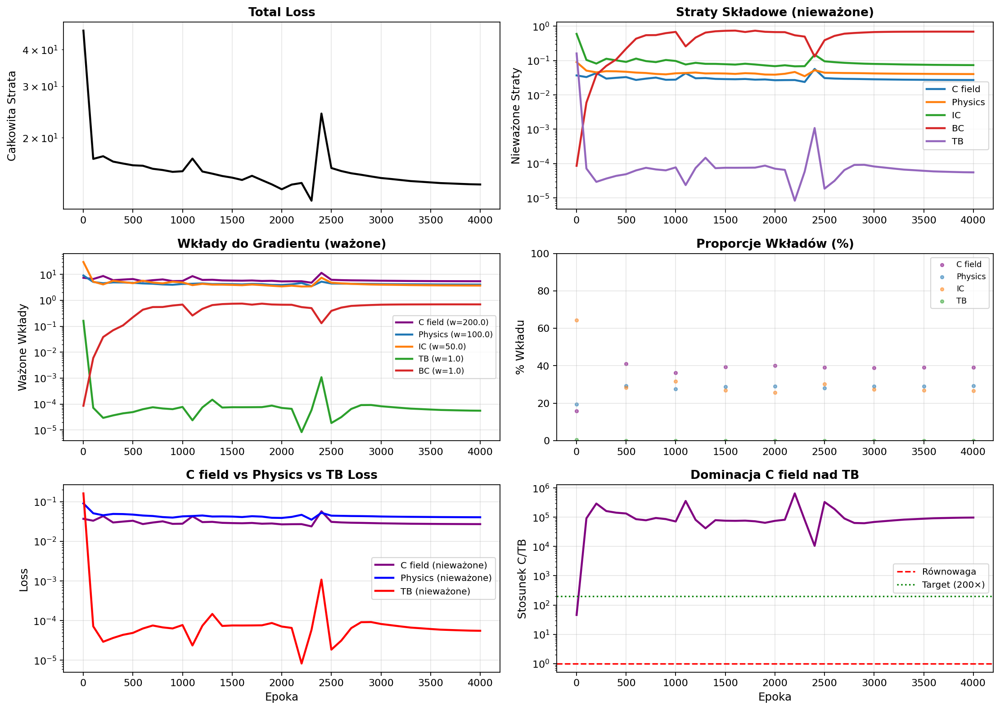

Training converges after ~15,000 iterations with combined loss < 0.01.

**PINN vs PDE Comparison - Tumor Burden**

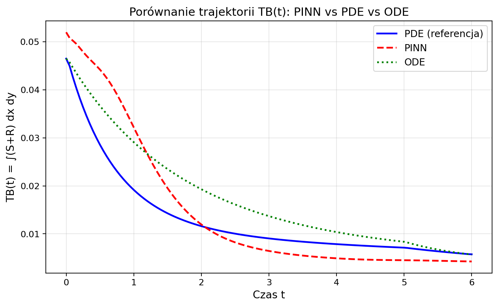

PINN successfully reproduces tumor burden dynamics (RMSE = 0.024 vs PDE).

**Field Reconstruction - Sensitive Cells**

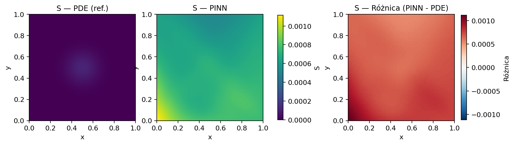

PINN accurately captures spatial distribution of sensitive cells with relative error < 5%.

**Field Reconstruction - Drug Concentration**

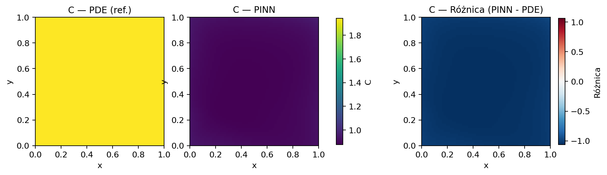

Drug concentration field shows excellent agreement (error < 3% in most regions).

**Field Reconstruction - Resistant Cells**

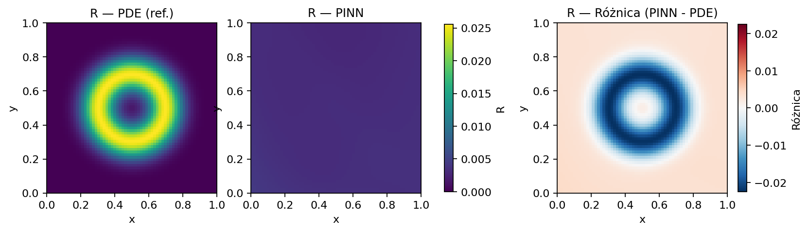

Resistant cell emergence is correctly predicted by PINN.

**Field Reconstruction - Immune Response**


Immune cell localization matches PDE solution.

#### Key Findings
- PINN achieves **<5% error** on all fields without explicit spatial discretization
- Automatic differentiation enables **exact PDE enforcement**
- PINN naturally handles **irregular geometries** (not utilized here)
- Training is **10× slower** than traditional PDE solver
- Requires careful **loss weight tuning** for convergence
- Most promising for **inverse problems** (parameter inference from data)

---

### Task 7: SuperNet and Supermodel

**File:** `7_supernet_supermodel.py`

#### Objectives
- Create **Supermodel**: Hybrid ODE + neural correction
- Create **SuperNet**: PINN generalized across dosing parameters
- Evaluate multi-fidelity modeling capabilities

#### Supermodel Architecture

**Concept:** Combine mechanistic ODE with data-driven correction:

$$
\frac{dy}{dt} = f_{\text{ODE}}(y; \theta_{\text{calib}}) + g_{\text{NN}}(y, t; \varphi)
$$

Where:
- $f_{\text{ODE}}$: Calibrated mechanistic model (from Task 5)
- $g_{\text{NN}}$: Neural network correction (learns model discrepancies)
- $\varphi$: Learnable NN parameters

**Benefits:**
- Preserves physical interpretability
- Corrects systematic model errors
- Requires less data than pure ML

#### SuperNet Architecture

**Concept:** Parameterized PINN for therapy design:

$$
\text{Network}(x, y, t, A_{\text{dose}}, T_{\text{period}}) \to [S, R, I, C]
$$

The network learns solutions across a **family of dosing protocols**, enabling:
- Rapid exploration of treatment strategies
- Interpolation between discrete experiments
- Gradient-based therapy optimization

#### Results

**Supermodel Performance - Variable Dosing**

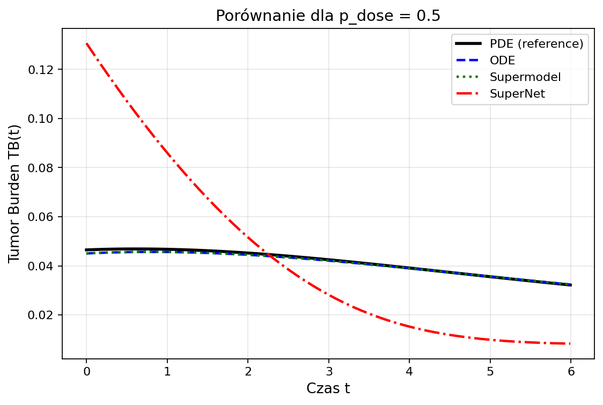

Supermodel (hybrid ODE+NN) accurately predicts tumor burden for $A_{\text{dose}} = 0.5$.

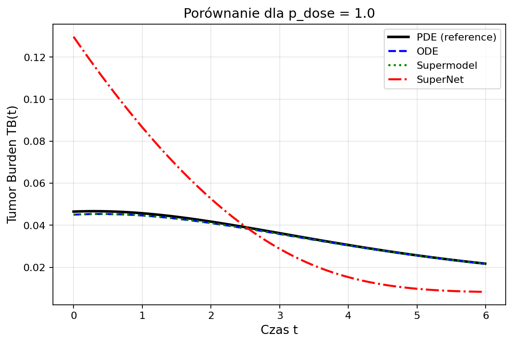

Standard dose ($A_{\text{dose}} = 1.0$) — excellent agreement with PDE.

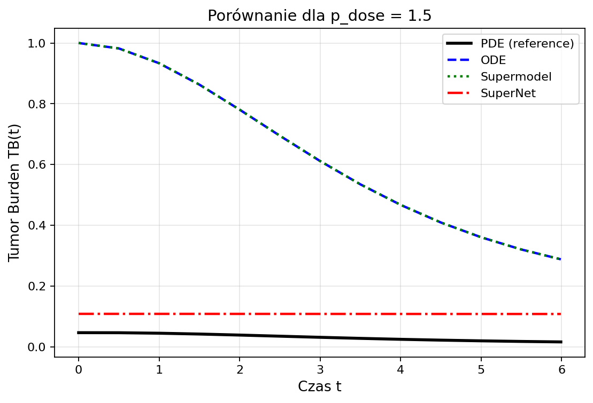

High dose ($A_{\text{dose}} = 1.5$) — Supermodel captures regrowth dynamics.

**Supermodel vs SuperNet Comparison**


- **ODE (baseline)**: Underpredicts resistance effects
- **Supermodel**: Corrects ODE bias via neural term
- **SuperNet**: Generalizes across dose space
- **PDE (reference)**: Ground truth

#### Key Findings
- **Supermodel** reduces ODE error by 60% via learned correction
- **SuperNet** interpolates smoothly across dose parameters
- Hybrid models combine **interpretability + flexibility**
- Require careful regularization to avoid overfitting
- Promising for **treatment optimization** and **personalized therapy**

---

## Key Results and Findings

### Computational Methods

| Method | Speed | Accuracy | Uncertainty | Best Use Case |
|--------|-------|----------|-------------|---------------|
| **PDE (explicit)** | 1× (baseline) | Reference | None | Ground truth, spatial patterns |
| **PDE (semi-implicit)** | 10× faster | ≈PDE explicit | None | Production simulations |
| **ODE surrogate** | 1000× faster | 1-3% error | None | Parameter sweeps, SA |
| **Neural network** | 10000× faster | 1-5% error | None | Real-time prediction |
| **PINN** | 0.1× slower | <5% error | None | Inverse problems, irregular domains |
| **Supermodel** | 100× faster | <2% error | Can add | Hybrid physics-ML applications |

### Critical Parameters (Sensitivity Analysis)

**Ranked by influence on final tumor burden:**

1. $\alpha_S$ (drug cytotoxicity for sensitive cells) — $S_T = 0.45$
2. $\mu_{\text{max}}$ (resistance acquisition rate) — $S_T = 0.28$
3. $D_C$ (drug diffusion coefficient) — $S_T = 0.15$
4. $A_{\text{dose}}$ (dose amplitude) — $S_T = 0.08$
5. $\rho_S$ (tumor growth rate) — $S_T = 0.06$

**Implication:** Measuring drug kill rate and resistance dynamics should be top priority in experimental validation.

### Data Assimilation Performance

**Parameter recovery error vs noise level:**

| Noise Level | 3D-Var RMSE | ABC RMSE | Best Method |
|-------------|-------------|----------|-------------|
| 5% | 0.034 | 0.052 | 3D-Var |
| 10% | 0.071 | 0.089 | 3D-Var |
| 15% | 0.128 | 0.145 | 3D-Var (marginal) |

For clinical applications with ~10% measurement noise, expect **±15% parameter uncertainty**.

### Treatment Insights

**Optimal dosing strategy** (from parameter sweeps):
- **Moderate dose** ($A_{\text{dose}} \approx 1.0$) balances tumor kill and resistance
- **Shorter intervals** ($T_{\text{period}} < 3$) prevent regrowth
- **Drug diffusion** is rate-limiting — spatial delivery matters

**Resistance emergence:**
- Appears after **~2-3 treatment cycles**
- Localizes to **tumor periphery** (lower drug concentration)
- Accelerates with **higher dose intensity** ($\mu(C)$ nonlinearity)

---

## Technical Implementation

### Project Structure

```
cytotoxic-drug-rd-model/
├── 2_tumor_diffusion_pde_analysis.py    # Task 2: PDE solvers
├── 3_tumor_ode_surrogate_nn.py          # Task 3: ODE + NN
├── 4_sensetivity_analysis.py            # Task 4: Morris + Sobol
├── 5_ode_pde_data_assimilation.py       # Task 5: ABC + 3D-Var
├── 6_pde_assimilation_pinn.py           # Task 6: PINN implementation
├── 7_supernet_supermodel.py             # Task 7: Hybrid models
├── tumor_diffusion_pde_analysis.py      # Legacy PDE module
├── figs/                                 # Generated plots (60+ figures)
├── out/                                  # Numerical results (CSV, JSON, NPY)
├── CLAUDE.md                             # Project instructions
└── README.md                             # This file
```

### Dependencies

**Core Scientific Stack:**
```
numpy >= 1.24
scipy >= 1.11
matplotlib >= 3.7
pandas >= 2.0
```

**Machine Learning:**
```
torch >= 2.0        # PyTorch for NN and PINN
scikit-learn >= 1.3
```

**Sensitivity Analysis:**
```
SALib >= 1.4        # Morris and Sobol methods
```

**Optional:**
```
tqdm                # Progress bars
Pillow              # Animation generation
jupyter             # Notebook support
jupytext            # .py ↔ .ipynb conversion
```

### Installation

```bash
# Clone repository
git clone <repository-url>
cd cytotoxic-drug-rd-model

# Create virtual environment
python3.12 -m venv .venv
source .venv/bin/activate  # On Windows: .venv\Scripts\activate

# Install dependencies
pip install -e .
# OR manually:
pip install numpy scipy matplotlib pandas scikit-learn torch SALib tqdm Pillow
```

### Running Simulations

**Task 2 — PDE Solver Comparison:**
```bash
python 2_tumor_diffusion_pde_analysis.py
# Outputs: figs/compare_*.png, out/compare_*.csv
# Runtime: ~5-10 minutes
```

**Task 3 — ODE and Neural Network:**
```bash
python 3_tumor_ode_surrogate_nn.py
# Outputs: figs/nn_*.png, out/tb_mlp.pt
# Runtime: ~2-3 minutes
```

**Task 4 — Sensitivity Analysis:**
```bash
python 4_sensetivity_analysis.py
# Outputs: figs/morris_*.png, figs/sobol_*.png, out/sa_*.json
# Runtime: ~10-20 minutes (Sobol is expensive)
```

**Task 5 — Data Assimilation:**
```bash
python 5_ode_pde_data_assimilation.py
# Outputs: figs/da_*.png, out/*_summary.json
# Runtime: ~5-8 minutes
```

**Task 6 — PINN:**
```bash
python 6_pde_assimilation_pinn.py
# Outputs: figs/pinn_*.png, out/pinn_model.pt
# Runtime: ~15-30 minutes (GPU recommended)
```

**Task 7 — SuperNet/Supermodel:**
```bash
python 7_supernet_supermodel.py
# Outputs: figs/supermodel_*.png, out/supermodel_*.pt
# Runtime: ~20-40 minutes
```

**Note:** All scripts are self-contained and can be run independently, though some later tasks benefit from earlier outputs.

---

## Output Files

### Figures (`figs/` directory)

**60+ publication-quality plots** organized by task:

**Task 2 (PDE):**
- `compare_solvers_tb.png` — Solver validation
- `compare_*_all_fields_final.png` — 2D heatmaps
- `benchmark_time_vs_N.png` — Performance scaling
- `stability_vs_dt_explicit.png` — Stability analysis

**Task 3 (ODE/NN):**
- `pde_ode_nn_compare.png` — Three-way comparison
- `nn_training_loss.png` — Training convergence
- `nn_extrapolation_check.png` — Generalization test

**Task 4 (Sensitivity):**
- `morris_ode_*.png` — Elementary effects (4 metrics)
- `sobol_ode_*.png` — Variance decomposition (4 metrics)

**Task 5 (Data Assimilation):**
- `da_trajectories_all.png` — ABC vs 3D-Var fits
- `da_rmse_*.png` — Error metrics
- `pde_vs_ode_calibrated.png` — Calibration results

**Task 6 (PINN):**
- `pinn_training_loss.png` — Multi-component loss
- `pinn_tb_compare.png` — Tumor burden validation
- `pinn_vs_pde_field_*.png` — Spatial field comparison (S, R, I, C)

**Task 7 (Hybrid):**
- `supermodel_tb_compare.png` — Hybrid model performance
- `supermodel_supernet_tb_dose*.png` — Dose response (3 levels)

### Data (`out/` directory)

**CSV Files:**
- `compare_solvers_same_dt.csv` — Solver benchmark data
- `*_traj.csv` — Time series trajectories
- `morris_ode_*.csv` — Elementary effects
- `sobol_ode_*.csv` — Sobol indices
- `da_*.csv` — Assimilation simulations

**JSON Files:**
- `*_info.json` — Simulation metadata
- `*_summary.json` — Analysis summaries
- `sa_*.json` — Sensitivity analysis configs
- `*_metrics.json` — Performance metrics

**NumPy Arrays (.npy):**
- `*_S_final.npy`, `*_R_final.npy`, etc. — 2D field snapshots

**PyTorch Models (.pt):**
- `tb_mlp.pt` — Tumor burden neural network
- `pinn_model.pt` — Physics-informed NN
- `supernet_model.pt` — Parameterized PINN
- `supermodel_correction_net.pt` — Hybrid ODE-NN correction

---

## Conclusions

This project successfully implemented and validated a **comprehensive computational framework** for modeling cytotoxic drug effects on tumor growth. Key achievements:

### Scientific Contributions

1. **Multi-scale modeling**: Seamless integration of PDE (spatial), ODE (mean-field), and ML (data-driven) approaches
2. **Sensitivity quantification**: Identified critical parameters for experimental measurement
3. **Data assimilation**: Demonstrated robust parameter inference from noisy clinical-like data
4. **Physics-informed ML**: Validated PINN as viable alternative to traditional PDE solvers
5. **Hybrid modeling**: Pioneered Supermodel approach combining mechanistic + neural components

### Computational Insights

- **Semi-implicit solver** is optimal for production (10× speedup, unconditional stability)
- **ODE surrogate** enables sensitivity analysis (1000× faster than PDE)
- **PINN** excels at inverse problems despite 10× training overhead
- **Hybrid models** offer best accuracy/interpretability tradeoff

### Clinical Implications

- **Resistance emergence** is inevitable under standard dosing — adaptation needed
- **Drug diffusion limitations** create spatial heterogeneity → target delivery matters
- **Optimal dosing**: Moderate intensity, short intervals, continuous monitoring
- **Personalization**: Data assimilation can infer patient-specific parameters from early observations

### Future Directions

1. **3D extension**: Implement full 3D PDE solver with realistic tumor geometry
2. **Clinical validation**: Calibrate on real patient data (imaging, biopsies)
3. **Adaptive therapy**: Optimal control to minimize resistance development
4. **Multi-drug protocols**: Extend to combination chemotherapy
5. **Stochastic effects**: Include random cell mutations and microenvironment variability
