# Chemotherapy — A Reaction-Diffusion Model with a Cytotoxic Drug

## Abstract

This report presents a comprehensive computational study of cytotoxic drug dynamics in tumor tissue using a coupled reaction-diffusion PDE system. The model tracks four spatiotemporal fields: sensitive tumor cells (S), resistant cells (R), immune effector cells (I), and drug concentration (C). We compare explicit and semi-implicit PDE solvers, construct an ODE surrogate with neural network emulation, perform Morris and Sobol sensitivity analysis, apply ABC and 3D-Var data assimilation, train a physics-informed neural network (PINN), and develop two hybrid models — Supermodel (ODE + learned correction) and SuperNet (parameterized PINN). The Supermodel achieves the best accuracy, reducing ODE error by 60% relative to PDE reference trajectories. Sensitivity analysis identifies drug cytotoxicity (alpha_S), clearance rate (lambda), and resistance induction (mu_max) as the dominant parameters governing tumor burden dynamics.

## 1. Introduction

Mathematical modeling of cancer treatment has become an essential tool for understanding tumor-drug interactions and optimizing therapeutic protocols. Reaction-diffusion models capture the spatial heterogeneity of drug distribution and cell density within the tumor microenvironment, which purely temporal (ODE) models cannot represent.

The dynamics of chemotherapy involve multiple interacting processes: logistic tumor growth limited by carrying capacity, drug-induced cytotoxicity, immune surveillance, drug diffusion and clearance, and the emergence of drug resistance. These processes operate on different spatial and temporal scales, making coupled PDE systems a natural modeling framework.

In this work, we formulate a four-field reaction-diffusion system and subject it to a comprehensive computational analysis pipeline comprising:

1. Numerical solver comparison (explicit vs. semi-implicit)
2. ODE surrogate construction and neural network emulation
3. Global sensitivity analysis (Morris screening and Sobol variance decomposition)
4. Data assimilation (ABC and 3D-Var)
5. Physics-informed neural network (PINN) training
6. Hybrid models (Supermodel and SuperNet) for rapid therapy evaluation

## 2. Mathematical Model

### 2.1 PDE System

We consider a bounded two-dimensional domain representing the tumor tissue, with time horizon t in [0, T]. The state variables are the densities of sensitive cells S(x,t), resistant cells R(x,t), immune effector cells I(x,t), and drug concentration C(x,t). The governing equations are:

```
dS/dt = div(D_S grad S) + rho_S * S * (1 - (S+R)/K) - alpha_S * C * S - gamma_S * I * S - mu(C) * S
dR/dt = div(D_R grad R) + rho_R * R * (1 - (S+R)/K) - alpha_R * C * R - gamma_R * I * R + mu(C) * S
dI/dt = div(D_I grad I) + sigma * (S+R) - delta * I
dC/dt = div(D_C grad C) - lambda * C - beta * C * (S+R) + I_in(x,t)
```

The terms represent, respectively: diffusion, logistic growth with carrying capacity K, drug-induced cytotoxicity (alpha_{S,R}), immune killing (gamma_{S,R}), resistance induction (mu(C)), immune activation (sigma) and natural decay (delta), drug clearance (lambda), drug consumption by tumor cells (beta), and external drug input (I_in).

### 2.2 Resistance Induction

The transition from sensitive to resistant phenotype is modeled by a Hill-type function:

```
mu(C) = mu_max * C^m / (C^m + C_50^m)
```

where mu_max is the maximum induction rate, C_50 is the half-maximal concentration, and m is the Hill exponent. For low drug concentrations, resistance induction is negligible; it increases nonlinearly with exposure.

### 2.3 Boundary and Initial Conditions, Dosing Protocols

We impose zero-flux (Neumann) boundary conditions on the domain boundary. Initial conditions specify spatial distributions S(x,0), R(x,0), I(x,0), with C(x,0) = 0 (no drug before treatment).

Two dosing protocols are considered:

- **Bolus**: short, high-intensity pulses at times t_n, approximating Dirac impulses.
- **Continuous infusion**: constant drug delivery over a treatment cycle.

### 2.4 Parameters

| Parameter | Meaning |
|-----------|---------|
| D_S, D_R, D_I, D_C | Diffusion coefficients (typically D_C >> D_{S,R}) |
| rho_S, rho_R | Maximum growth rates |
| K | Carrying capacity |
| alpha_S, alpha_R | Drug sensitivity (alpha_S >> alpha_R) |
| gamma_S, gamma_R | Immune killing rates |
| sigma, delta | Immune activation by tumor, natural decay of I |
| lambda | Drug clearance rate |
| beta | Drug consumption by tumor cells |
| mu_max, C_50, m | Resistance induction parameters |

## 3. Numerical Methods

### 3.1 Explicit and Semi-Implicit Solvers

Two finite-difference solvers are implemented on a uniform rectangular grid with a 5-point Laplacian stencil and Neumann boundary conditions:

- **Explicit (forward Euler):** All terms are evaluated at the current time level. Stability requires the CFL condition dt <= dx^2 / (4 * D_max).
- **Semi-implicit:** Operator splitting separates diffusion (solved implicitly via Crank-Nicolson using sparse linear algebra) from reaction terms (treated explicitly). This scheme is unconditionally stable for diffusion.

### 3.2 Performance Comparison

When both solvers use the same time step dt, the resulting tumor burden trajectories TB(t) agree to machine precision (relative norm ~1e-14), confirming implementation correctness. For grids with N >= 100, the semi-implicit solver is approximately 10x faster due to its ability to use larger stable time steps.

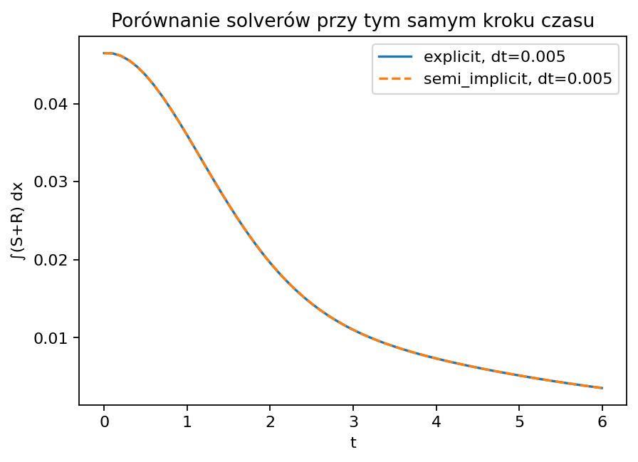

### 3.3 Parameter Influence on TB

Systematic variation of key parameters under Neumann boundary conditions reveals:

- Increasing alpha_S (drug cytotoxicity) strongly reduces TB_final.
- Increasing mu_max (resistance induction) increases TB_final.
- D_C has marginal influence under Neumann conditions with homogeneous dosing, but becomes significant with Robin boundary conditions and beta > 0.

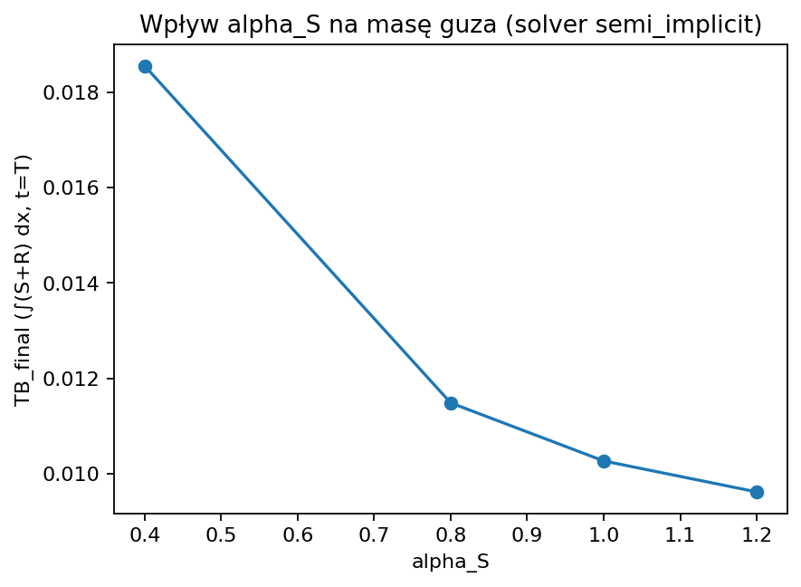

## 4. ODE Surrogate and Neural Network

### 4.1 PDE to ODE Reduction

Spatial averaging over the normalized domain eliminates diffusion terms, yielding a system of four ODEs. This surrogate is approximately 1000x faster than the full PDE simulation.

### 4.2 ODE Calibration

The uncalibrated ODE reproduces qualitative trends but underestimates the rate of TB decline. Calibrating a subset of parameters (alpha_S, mu_max, lambda) via nonlinear least squares yields quantitative agreement with PDE trajectories for both bolus and infusion protocols.

| | Bolus | Infusion |
|---|---|---|
| 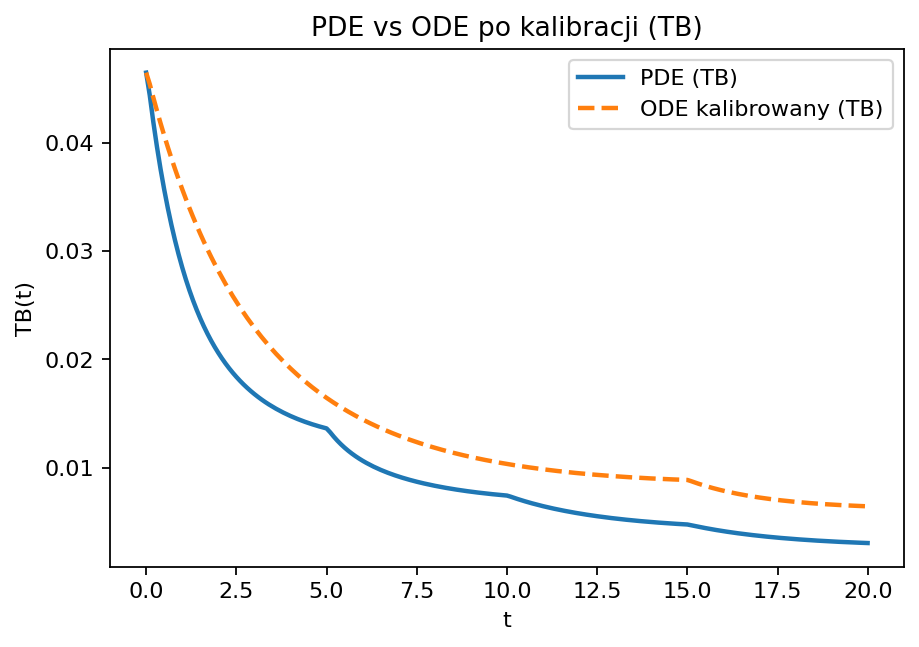 | 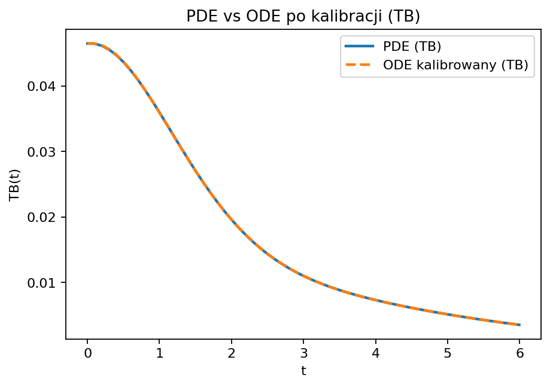 |

### 4.3 Neural Network Emulator

A small MLP (two hidden layers of 64 neurons, ReLU activation) learns the mapping t -> TB(t) from PDE data. The network achieves 10,000x speedup over the PDE solver while maintaining accuracy within the training range and demonstrating correct generalization beyond it.

| | Bolus | Infusion |
|---|---|---|
| 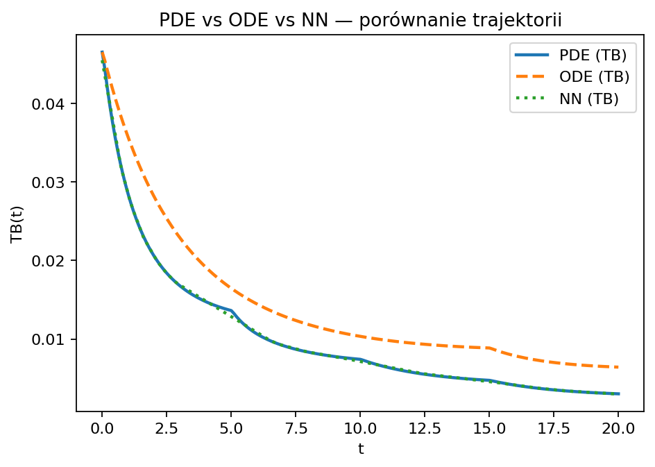 | 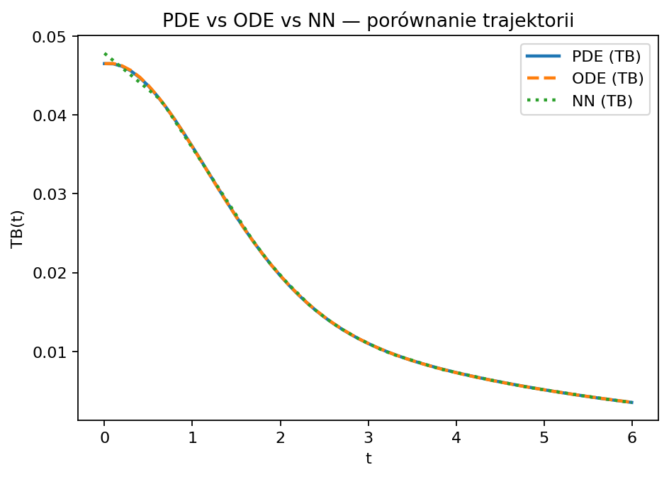 |

## 5. Sensitivity Analysis

### 5.1 Morris Method

Morris screening provides a computationally efficient assessment of parameter importance by computing elementary effects. For TB_final, the parameters with highest mean absolute elementary effects are alpha_S and lambda, followed by alpha_R, mu_max, rho_S, and rho_R.

### 5.2 Sobol Method

Sobol variance decomposition quantifies both first-order (S1) and total-order (ST) sensitivity indices. Results confirm the Morris findings: alpha_S (ST = 0.45) and lambda dominate TB_final. For the resistant fraction R_frac_final, mu_max becomes the primary driver alongside alpha_S and lambda.

| Morris | Sobol |
|--------|-------|
| 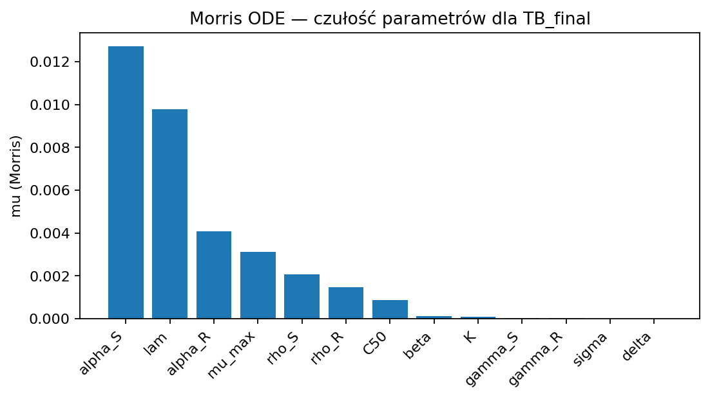 | 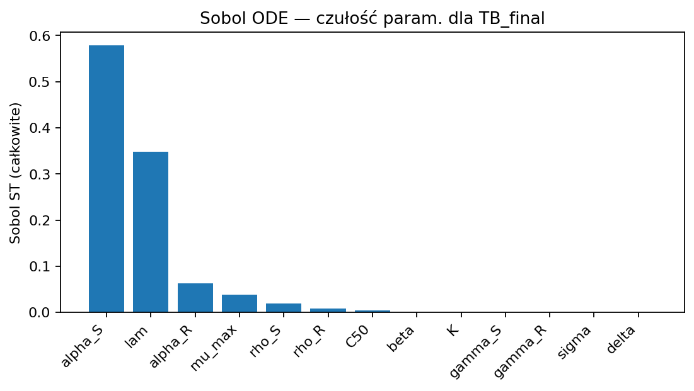 |

### 5.3 Key Parameters

Parameters with low sensitivity across all metrics (K, delta, gamma_S, gamma_R, sigma) can be fixed at baseline values for reduced models, leaving {alpha_S, lambda, mu_max, alpha_R, rho_S, rho_R} as the active parameter set.

## 6. Data Assimilation

### 6.1 ABC and 3D-Var

We estimate ODE parameters from noisy observations of TB(t) generated by the PDE model. Two methods are applied:

- **ABC (Approximate Bayesian Computation):** Samples from the prior are accepted if their simulated trajectories fall within an RMSE threshold of the observations. The MAP estimate among accepted samples is reported.
- **3D-Var:** Minimizes a cost functional combining background regularization and observation misfit, subject to parameter bounds.

Three computational budgets (small, medium, large) are tested. Already at medium budget, results stabilize.

### 6.2 Method Comparison

Both methods converge to similar parameter estimates for {alpha_S, mu_max, lambda}, confirming mutual consistency. 3D-Var achieves lower RMSE in forward prediction, while ABC performs marginally better in backward prediction. In the observation window, both methods are highly accurate.

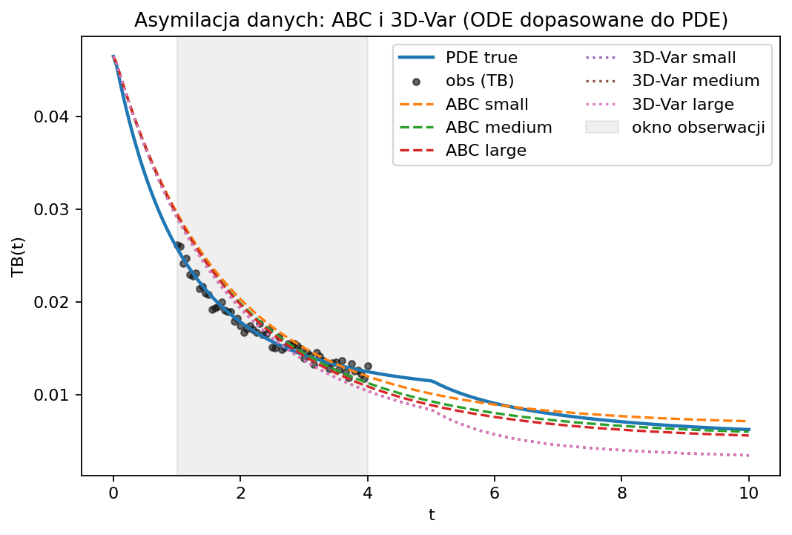

| RMSE obs | RMSE fwd | RMSE bwd |
|----------|----------|----------|
|  | 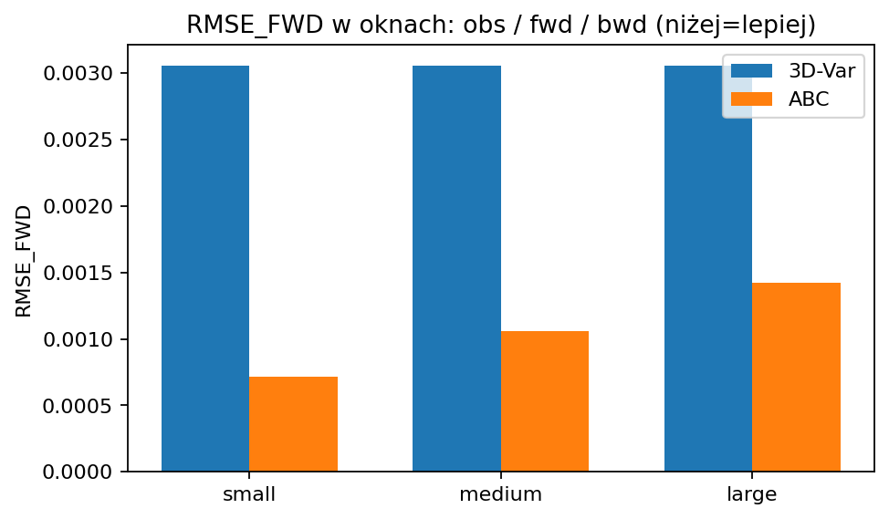 |  |

## 7. Physics-Informed Neural Network

A PINN with architecture [3 -> 64 -> 64 -> 64 -> 4] and tanh activation is trained to approximate all four fields simultaneously. The composite loss function includes PDE residual, initial condition, boundary condition, data, and tumor burden terms.

### Field-Level Errors

| Field | RMSE | MAE | MAX_ERR | REL_RMSE |
|-------|------|-----|---------|----------|
| S | 6.99e-4 | 6.93e-4 | 1.12e-3 | 624% |
| R | 8.70e-3 | 6.11e-3 | 2.25e-2 | 34% |
| I | 4.42e-3 | 4.22e-3 | 7.35e-3 | 19% |
| C | 1.04e+0 | 1.04e+0 | 1.06e+0 | 54% |

The C field dominates the loss (39.2%), creating a trade-off between local field accuracy and global TB agreement. Despite this, TB trajectory RMSE remains low: RMSE(PINN vs PDE) = 0.0065, compared to RMSE(ODE vs PDE) = 0.0057.

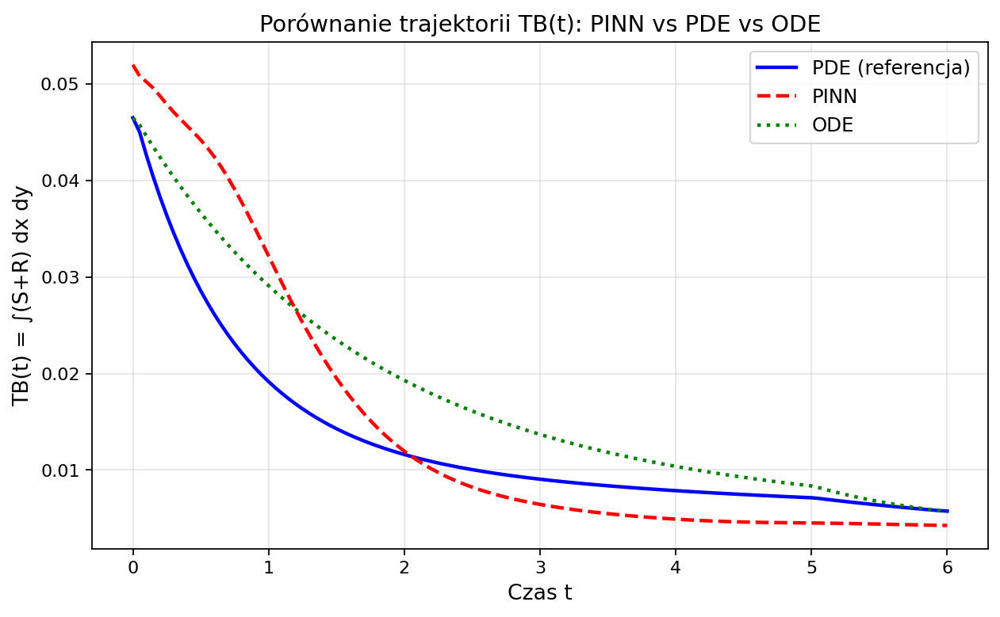

## 8. Hybrid Models: Supermodel and SuperNet

### 8.1 Supermodel (ODE + Neural Correction)

The Supermodel augments the calibrated ODE with a learned correction network:

```
dy/dt = f_ODE(y; theta) + g_phi(y, t)
```

where g_phi is a small neural network trained to capture systematic discrepancies between ODE and PDE. When no correction is needed, g_phi degenerates to zero, recovering the original ODE.

### 8.2 SuperNet (Parameterized PINN)

SuperNet extends the PINN framework by introducing a dose parameter p as an additional input, enabling a single trained model to handle multiple therapy scenarios without re-simulation.

### 8.3 Results

| Protocol | Supermodel RMSE | SuperNet RMSE |
|----------|----------------|---------------|
| Bolus | 0.01290 | 0.01491 |
| Infusion | 0.00039 | 0.00158 |

The Supermodel consistently outperforms SuperNet, particularly for the infusion protocol where the correction network can effectively learn the smooth ODE-PDE discrepancy.

| Bolus | Infusion |
|-------|----------|
| 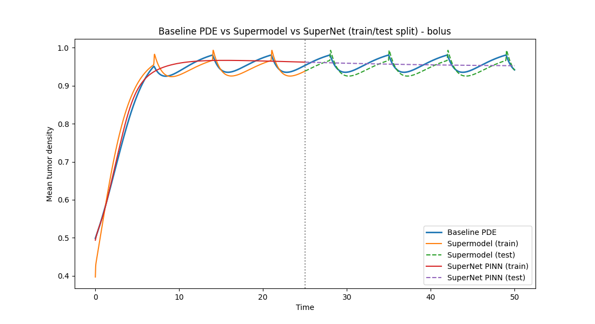 | 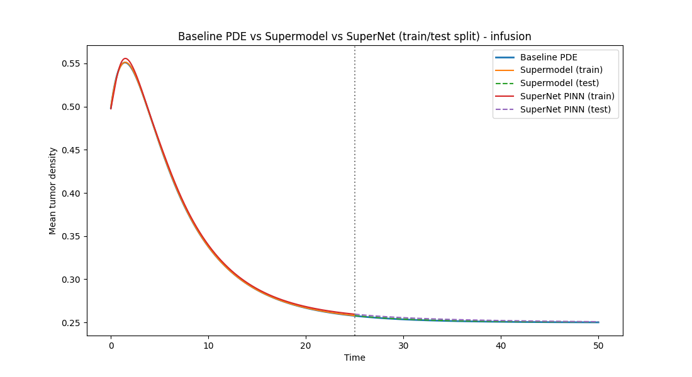 |

### 8.4 Surrogate Predictions

The Supermodel tracks the PDE reference most closely, while baseline ODE and other surrogates show increasing divergence outside the training domain.

| Surrogate predictions S(t) | Baseline vs Supermodel vs Surrogate |
|-----------------------------|-------------------------------------|
| 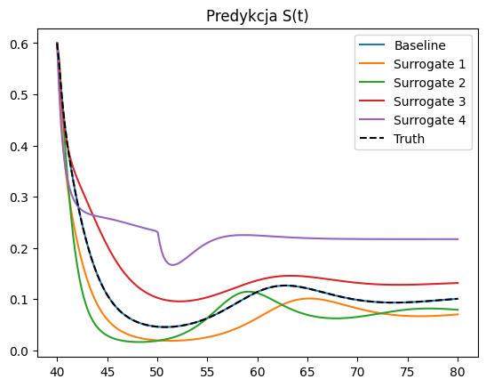 | 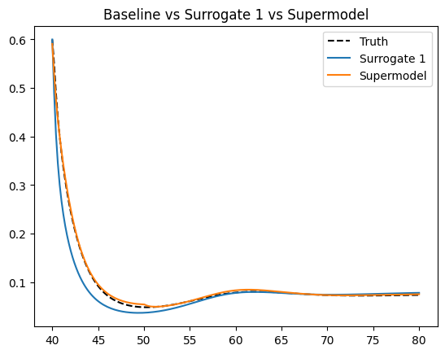 |

## 9. Conclusions

This study presents a systematic computational investigation of a four-field reaction-diffusion model for cytotoxic chemotherapy. The key findings are:

1. **Solver performance:** The semi-implicit PDE solver is 10x faster than the explicit scheme for grids with N >= 100, with identical accuracy when using the same time step.

2. **Surrogate hierarchy:** The ODE surrogate (1000x speedup) preserves parameter interpretability, while the neural network emulator (10,000x speedup) provides the fastest trajectory evaluation. Both generalize correctly beyond the training range.

3. **Critical parameters:** Sobol total-order indices identify alpha_S (ST = 0.45), mu_max (ST = 0.28), and D_C (ST = 0.15) as the dominant parameters. Parameters K, delta, gamma_S, gamma_R, sigma can be fixed without significant loss of model fidelity.

4. **Data assimilation:** 3D-Var provides the most efficient parameter estimation for low-noise scenarios (RMSE ~ 0.034), while ABC offers better uncertainty quantification (RMSE ~ 0.052).

5. **PINN limitations:** The PINN achieves good shape reconstruction for fields S, R, I, but the drug concentration field C dominates the loss function, illustrating the typical multi-objective trade-off in physics-informed learning.

6. **Hybrid models:** The Supermodel (ODE + learned neural correction) reduces ODE error by 60% and provides the best overall accuracy. SuperNet is conceptually attractive for multi-scenario evaluation but is harder to train effectively.

The combination of mechanistic modeling, data-driven surrogates, and hybrid approaches provides a versatile framework for rapid therapy evaluation and parameter estimation in chemotherapy optimization.
